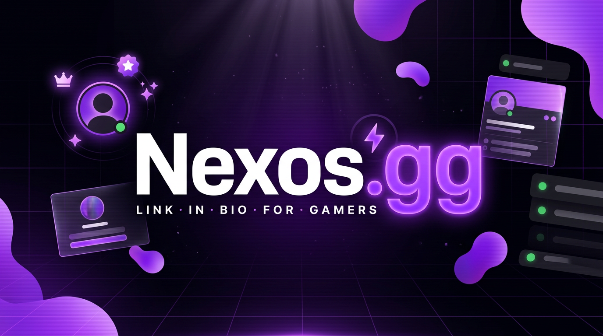

<div align="center">



# NexosGG

### A plataforma *link-in-bio* feita para a comunidade gamer e de streamers

Um perfil público, personalizável e em tempo real em `nexos.gg/seu-usuario` —
para centralizar toda a sua presença online em um só lugar.

[](https://nexos.gg)
[](https://github.com/R3D3-Desenvolvimentos)

</div>

---

## 🎮 O que é

NexosGG é uma plataforma de perfil de links personalizável — pense em um Linktree, mas
construído sob medida para gamers e criadores de conteúdo. Vem com integração de presença
do Discord em tempo real, player de áudio com visualizador, widgets de plataformas, efeitos
animados e um motor de temas completo — tudo gerenciável por um painel em tempo real.

> Este repositório é uma **vitrine**: apresenta o produto e suas capacidades.
> O código-fonte é proprietário e mantido em repositório privado.

---

## ✨ Destaques

### Perfil & Personalização
- **Links ilimitados** com ícones por plataforma (Twitch, YouTube, Steam, Kick, TikTok…)
- **Motor de temas completo** — cor/imagem/vídeo de fundo, cores de destaque, blur, opacidade, gradientes e partículas animadas
- **Animações de nome** — 12+ efeitos: typewriter, glow, gradiente, glitch, rainbow
- **Cursor customizado** e **templates de layout** (clássico e cards)

### Integrações de Plataforma
- **Presença do Discord ao vivo** — status, atividade atual e tag de servidor em tempo real, via bot dedicado + Supabase Realtime
- **Widgets** de GitHub, YouTube, Last.fm e Roblox
- **Player de áudio com visualizador** — playlist embutida com múltiplos modos de visualização

### Engajamento & Descoberta
- **Sistema de badges** — 16+ colecionáveis (Staff, Premium, Verificado, OG, eventos sazonais)
- **Controles de SEO** por perfil — meta título, descrição, favicon e imagem OG

### Analytics & Monetização
- **Painel de analytics** — visitas, cliques por link e mapa de países dos visitantes (choropleth D3)
- **Tier Premium** via Stripe — compra única vitalícia que libera 30+ fontes, efeitos avançados e layouts exclusivos

---

## 🏗️ Arquitetura em destaque

**Presença do Discord em tempo real** — um bot dedicado escuta o Discord Gateway e grava os
dados de presença no Supabase. O perfil público assina as mudanças via Realtime e renderiza
ao vivo, sem polling.

```
Discord Gateway → bot → Supabase (discord_presences)
                              ↓ Realtime
                      nexos.gg/usuario → presença ao vivo
```

---

## 🧩 Stack

<div align="center">


</div>

---

<div align="center">

Um produto **[R3D3 Desenvolvimentos](https://github.com/R3D3-Desenvolvimentos)** ·
[r3d3s.com.br](https://r3d3s.com.br) · [atendimento@r3d3s.com.br](mailto:atendimento@r3d3s.com.br)

</div>
